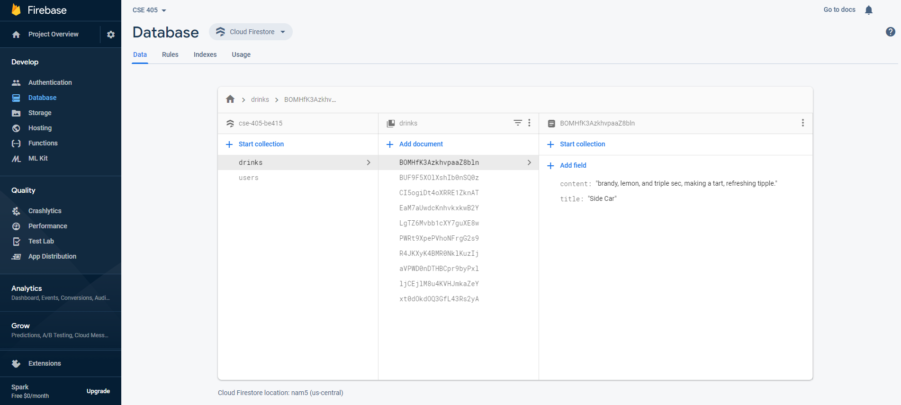
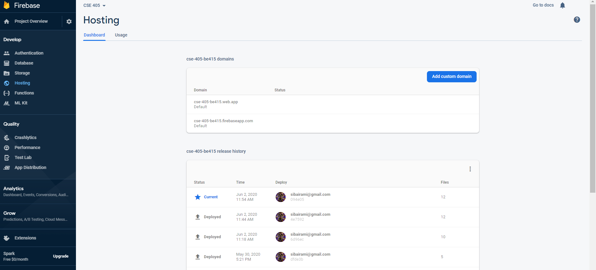
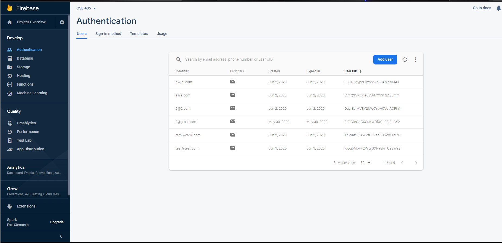
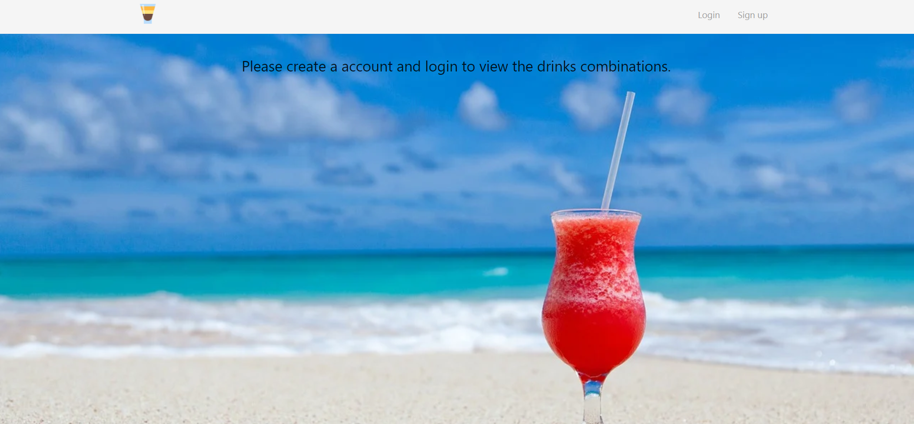
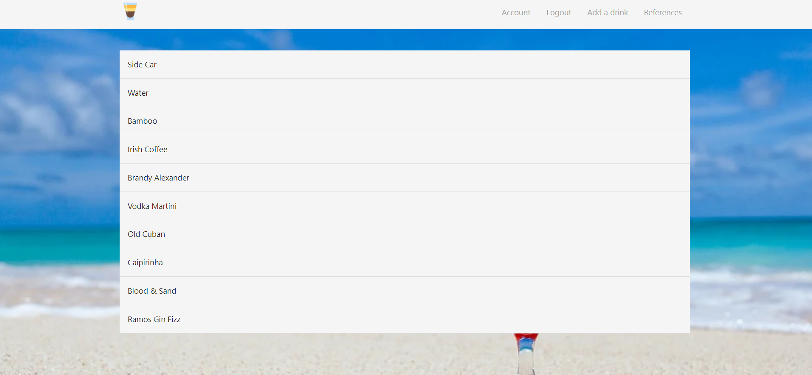

# CSE405 Progress Report

So for the Web App I made a website called Mixer and on the Website you can login,logout, view your account info, view a references tab, and create and view drinks for yourself and others to see. I followed alot of guides from https://www.youtube.com/channel/UCW5YeuERMmlnqo4oq8vwUpg. I learned how to use firebase fully and here are some images to show that it is working. The link to the website is https://cse-405-be415.web.app/.

